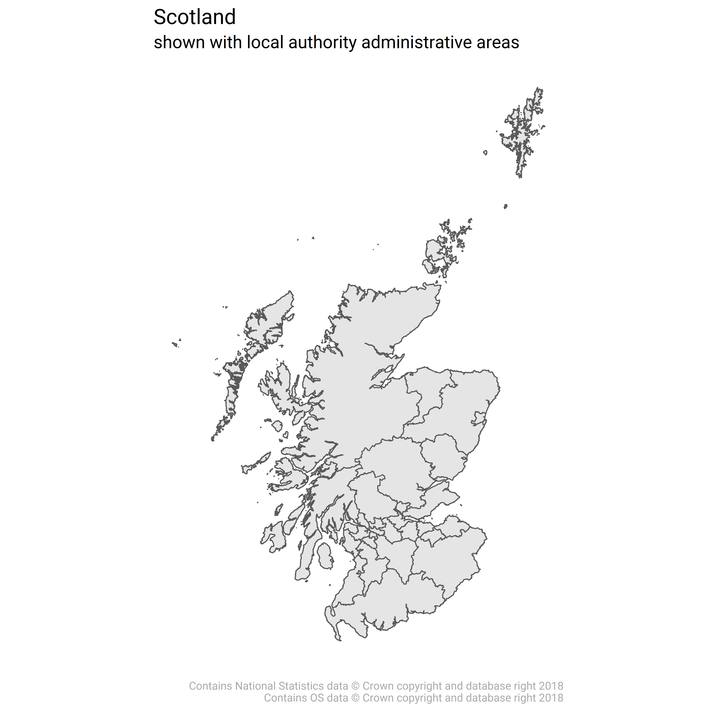

##Intro

A quick cleaning of a shapefile that *should* be able to be used very quickly with any dataset at Local authority level. 

A walkthrough of the code can be viewed [here](clean_shape.html)

The saved `sf` object `scotland_la.rds` is in my GitHub repo [here](https://github.com/davidhen/clean_shapefile_scotland_LA/tree/master/assets/clean_data). Feel free to clone the repo and use the dataframe for mapping Scottish Local Authorities. 

Check out [my homepage](https://www.davidhen.com/) for more projects, publications, and talks. 